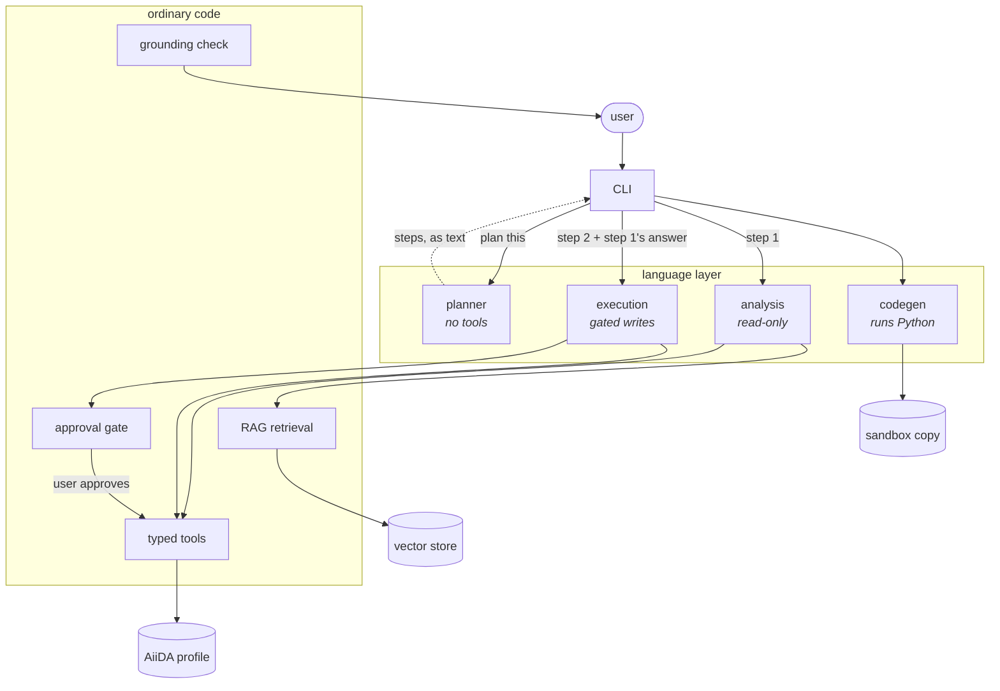

# `aiida-agents`

A natural-language, multi-agent interface to AiiDA

<div class="pt-8 opacity-70">
Jaweria Batool · GSoC 2026 · MSD group seminar, 21 Aug 2026
</div>

---

# What it is

<div class="pb-3">

Specialist agents call **typed Python tools** against a real AiiDA profile.
Every answer is built from what those tools returned.

</div>

```console
$ aiida-agents ask "why did pk 334599 fail?"
→ analysis agent

PwBaseWorkChain 334599 exited 501, but that is the work chain reporting that a
sub-process failed. The actual failure is PwCalculation 334407, also exit 501:
"The ionic minimization cycle converged but the thresholds are exceeded in the
final SCF."

The work chain already tried its one applicable remedy:
handle_vcrelax_converged_except_final_scf fired on iteration 1. It still
landed on this exit code, so simply restarting is unlikely to help.
```

<div class="pt-3 text-sm opacity-60">

Real run against a Quantum ESPRESSO profile. The pks, the exit code and the handler name
all came out of tool calls.

</div>

---

# What you can ask it

<div class="grid grid-cols-3 gap-4 pt-6 text-sm">

<div class="border-l-2 border-gray-300 pl-3">

### Explore

Count and rank nodes, follow provenance, search structures by formula, summarise what past
runs of a workflow actually used.

</div>

<div class="border-l-2 border-gray-300 pl-3">

### Diagnose

Walk from a work chain's exit code down to the calculation that broke. Read the exit code's
meaning off the process class. Report which restart handlers already fired.

</div>

<div class="border-l-2 border-gray-300 pl-3">

### Check the plumbing

A process waiting on a stopped daemon has nothing wrong with it, and every status tool calls
it "waiting" forever. The agents check the daemon and say which of the two it is.

</div>

<div class="border-l-2 border-gray-300 pl-3">

### Set up and submit

Discover installed workflows, inspect input schemas, build from a protocol builder, draft
from declared ports. Cutoffs checked against the pseudopotential family.

</div>

<div class="border-l-2 border-gray-300 pl-3">

### Sequence and batch

Wait for a submission and feed its output to the next. Rebuild a past run, change one
parameter, resubmit the set under a single approval.

</div>

<div class="border-l-2 border-gray-300 pl-3">

### Query and compute

For anything no fixed tool expresses: write the `QueryBuilder` code, run it against a
sandbox copy, report what it returned.

</div>

</div>

---

# What is in the box

```text
src/aiida_agents/
├─ agents/          the language layer, and the only part that is a model
│  ├─ planner/        no tools: decides which specialists run, in what order
│  ├─ analysis/       read-only exploration of the provenance graph
│  ├─ execution/      builds and submits; every write is gated
│  ├─ codegen/        writes Python, runs it in the sandbox, reads its own traceback
│  └─ handoff.py      typed context passed from one step to the next
├─ tools/           one typed tool layer, shared by every agent and by MCP
├─ rag/             AiiDA docs: chunk, embed, index, cite the page it came from
├─ sandbox/         a disposable copy of the profile, for generated code
├─ mcp/             20 read-only tools over MCP, for any client
├─ plugins/         one entry point: tools, docs corpora, prompt fragment
├─ cli/             ask · chat · doctor · config · sandbox · mcp, and the approval gate
├─ grounding.py     post-answer check: no quantity that no tool returned
└─ _settings.py     provider, model, sandbox, RAG, all from env or .env
```

<div class="pt-3 text-sm opacity-70">

Three things are agents. Everything else is ordinary, testable Python.

</div>

---

# Pointing it at a model

<div class="pb-2 text-sm">

Every knob is `AIIDA_AGENTS_*`, read from the environment or a `.env`, validated at startup.

</div>

```bash
export AIIDA_AGENTS_PROVIDER=ollama       # openai | anthropic | openrouter | openai-compatible
export AIIDA_AGENTS_MODEL=qwen3.5:2b

aiida-agents config show                  # every setting, and where its value came from
aiida-agents doctor                       # profile, model, RAG index, sandbox, docs toolchain
```

<div class="grid grid-cols-2 gap-6 pt-4 text-sm">

<div>

Overridable per invocation, so one shell can talk to two models:

```bash
aiida-agents --provider anthropic \
             --model claude-... ask "..."
```

</div>

<div>

`doctor` reports every subsystem and, for each failure, the command that fixes it.

The rule everywhere: **fail loud, not open.** A lookup that finds nothing says so rather
than substituting a plausible default.

</div>

</div>

---

# Using it

<div class="grid grid-cols-2 gap-6 pt-2 text-sm">

<div>

```bash
# one-shot, cannot approve anything
aiida-agents ask "how many workchains
                  finished successfully?"

# interactive, and the only mode that
# can approve a write
aiida-agents chat

# serve the read-only tools to any
# MCP client
aiida-agents mcp
```

</div>

<div>

The REPL keeps persistent history, multiline input and vi mode.

`AIIDA_AGENTS_LOG_LEVEL=DEBUG` prints the tool calls behind each answer, which is the only
place the traceability is actually visible.

A request that wants to submit, made through `ask`, is told to use `chat` instead of
silently doing it.

</div>

</div>

<div class="pt-4">

When a step proposes a write, the run pauses and the CLI shows the **resolved** inputs:

</div>

```text
submit_workflow(process=PwBaseWorkChain, code=InstalledCode(pk=1),
                structure=StructureData(pk=4021, Si2), kpoints_distance=0.15)
Approve? [y/N]
```

---
layout: center
class: text-center
---

# Live demo

<div class="text-lg opacity-70 pt-6">

`aiida-agents ask "why did pk 334599 fail?"`

</div>

<div class="pt-6 text-sm opacity-60">

diagnose a failure · deny an approval and show nothing changed · try to talk it out of the
gate · a two-step plan · codegen against the sandbox

</div>

---

# How a request travels



<div class="pt-2 text-sm opacity-70">

The planner never calls a specialist and specialists never call each other. The CLI runs
each step. That is what keeps the approval loop resumable by the agent that proposed the write.

</div>

---

# Where the decisions are made

<div class="pt-2 text-sm">

| Concern | Decided by | Why |
| --- | --- | --- |
| Which specialist handles a request, and in what order | **Model** | A natural-language intent problem. No reliable rule exists. |
| Which tool to call, with what arguments | **Model** | Same. |
| Whether a write needs approval | **Code** | A prompt can be argued out of it. A tool boundary cannot. |
| Input validation and node-reference resolution | **Code** | Deterministic and testable. A model adds only variance. |
| Whether an answer's numbers are supported | **Code** | Checked after the fact, so it does not depend on the model having complied. |

</div>

<div class="pt-6 opacity-70">

The language layer is thin on purpose. Everything a wrong answer could damage is decided by code.

</div>

---

# Three specialists

<div class="pt-2 text-sm">

| | Tool surface | Can write? | Working loop |
| --- | --- | --- | --- |
| **Analysis** | query nodes, provenance, process reports, retrieved files, diagnostics, daemon status, docs search | No tool exists | Look it up, explain it |
| **Execution** | discover workflows, inspect schemas, build and draft inputs, check ranges, submit, wait, resubmit | 3 tools, all approval-gated | Build, show, ask, submit |
| **Codegen** | write Python, run it, read the output | Only against the sandbox copy | Write, run, read the traceback, retry |

</div>

<div class="pt-6 opacity-70">

The bar for a new specialist: **its own tool surface and its own prompt.** Diagnosis met
neither and stayed a tool on Analysis. Codegen was the first case that met both.

</div>

---

# Models: cloud, local, sovereign

<div class="grid grid-cols-2 gap-8 pt-4 text-sm">

<div>

| Provider | Reaches |
| --- | --- |
| `ollama` | a model on your own machine |
| `openai` | GPT models |
| `anthropic` | Claude models |
| `openrouter` | one key, many providers |
| `openai-compatible` | any endpoint with a `base_url` |

<div class="pt-4">

The last row is the interesting one. A Swiss-hosted Apertus endpoint, a vLLM server on a
group machine and a DeepSeek key all arrive the same way.

</div>

</div>

<div>

**Small local models drove real design.** The read/write split and the narrow per-agent tool
surfaces exist because a 2B model cannot choose well from forty tools.

**`context_length` and `max_tokens` are validated against each other**, so a budget that
cannot fit its own window fails at startup instead of truncating halfway through a run.

**Nothing in the tool layer knows which provider is loaded.** Swapping the model changes one
environment variable.

</div>

</div>

---

# RAG over the AiiDA docs

<div class="grid grid-cols-2 gap-8 pt-4">

<div class="text-sm">

```bash
aiida-agents rag build    # clone, render, chunk, embed, index
aiida-agents rag search "how do I restart a workchain"
```

**ChromaDB** as the store, **Ollama** with `mxbai-embed-large` for embeddings, with a
sentence-transformers fallback so CI and offline machines work.

Answers cite the page they came from.

</div>

<div class="text-sm">

**A collection is keyed by docs version, corpus format and embedding model.**

So a query can never hit an index built with a different embedder, which is the failure mode
that produces confident nonsense with no visible cause.

**Plugins contribute their own corpora**, version-keyed the same way. Reading pw.x's output
format is knowledge that belongs to `aiida-quantumespresso`, not here.

</div>

</div>

---

# MCP: the same tools, in any client

<div class="grid grid-cols-2 gap-8 pt-4 text-sm">

<div>

```bash
aiida-agents mcp    # streamable-http, port 8000
```

Then point a client at it:

```bash
claude mcp add --transport http \
  aiida-agents http://127.0.0.1:8000/mcp
```

**20 read-only tools**: process status and reports, diagnostics, daemon status, node
inputs and outputs, provenance, structure search, workflow discovery, input building,
resubmission specs.

</div>

<div>

**The write tools are deliberately absent.** A generic MCP client has no approval gate, so
submissions, imports and deletes stay in the CLI.

**Codegen is absent too.** Its safety rests on `AIIDA_AGENTS_SANDBOX_PROFILE` naming a
profile someone verified. An MCP client cannot check that and we cannot see whether it holds.
A client that wants to run Python can run it itself, with its own consent.

</div>

</div>

---

# "Why not just write a Claude Code plugin?"

<div class="grid grid-cols-2 gap-8 pt-4 text-sm">

<div>

**Models you are allowed to use.** A lot of provenance is unpublished. Ollama on a laptop
and a Swiss-hosted Apertus endpoint are configuration here; with a vendor's client they are
not available at all.

**Control over the loop.** The approval gate, the typed handoff, the plan cap and the
post-answer grounding check are ours. A plugin inherits the host's loop and can only add tools
to it.

**Python.** The tools import the AiiDA ORM directly, in the language AiiDA and every AiiDA
plugin is written in.

</div>

<div>

**And it is not either/or.**

```bash
aiida-agents mcp
claude mcp add --transport http \
  aiida-agents http://127.0.0.1:8000/mcp
```

Claude Code then reaches the same 20 tools, through the same typed layer, against the same
profile.

<div class="pt-4 opacity-70">

The CLI is where local models and gated writes live. MCP is how everything else gets in.

</div>

</div>

</div>

---

# Extending it, without depending on it

<div class="pb-2 text-sm">

A plugin contributes through one entry point. This package never imports yours.

</div>

```toml
[project.entry-points."aiida_agents.plugins"]
quantumespresso = "my_plugin.agents:PROVIDER"
```

<div class="grid grid-cols-3 gap-4 pt-4 text-sm">

<div class="border-l-2 border-gray-300 pl-3">

**`tools()`**

Your domain tools. `writes=True` puts one behind the approval gate automatically, and there
is no way to opt out.

</div>

<div class="border-l-2 border-gray-300 pl-3">

**`rag_corpora()`**

Your documentation, version-keyed, cited with a link to the page it came from.

</div>

<div class="border-l-2 border-gray-300 pl-3">

**`prompt_fragment()`**

Your conventions and your units. The core prompt wins on conflict.

</div>

</div>

<div class="pt-6 opacity-70 text-sm">

Reading pw.x's SCF trace is exactly the knowledge that belongs to the plugin. A plugin for
another code contributes its own equivalent, without either package learning about the other.

</div>

---

# Generated code runs against a copy

<div class="grid grid-cols-2 gap-6 pt-2 text-sm">

<div>

### What we built first

A second profile pointing at the **same** database, through a PostgreSQL role with no write
privilege. The framing was shared-versus-empty: an empty database cannot answer "which
structures did I relax last month".

### What it cost

Deleting the sandbox profile and agreeing to delete its data deletes the storage under
**both** profiles. A read-only role does not help, because the destructive command is run by
the user, as themselves, against a profile they were told was disposable.

Two more things it got wrong: the printed setup command could never complete, because the
read-only role refuses the default-user insert; and SQLite, the `verdi presto` default, has
no roles at all.

</div>

<div>

### The rule that replaced it

```python
def shares_storage(...) -> bool:
    """Whether deleting one profile's
    data would destroy the other's.

    Fails closed: a backend we cannot
    reason about counts as sharing.
    """
```

`init` refuses to register a sharing sandbox · `check` fails on one · `teardown` refuses to
delete one · `doctor` reports it. One implementation, four callers.

Locations are typed (`PathLocation`, `DatabaseLocation`) rather than tagged strings, and
**containment counts as overlap**, because one storage nested inside another compared as
separate right up until `teardown` removed the parent recursively.

</div>

</div>

<div class="pt-3 text-center">

The choice was framed as shared or empty. **A copy is neither.**

</div>

---

# What the sandbox is, and is not

<div class="grid grid-cols-2 gap-6 pt-4 text-sm">

<div>

### It is a scratch profile

The copy is **writable, on purpose**. A researcher iterating on inputs they are unsure of
wants somewhere to be wrong five times. Five excepted workflows and a batch submitted with
the wrong parameters belong in a profile that gets thrown away.

Separation is proved twice: `init` refuses a layout that would copy a source into itself
before writing anything, and `run_aiida_code` asks the same question again at run time,
because the setting it trusts is a profile name and nothing stops it naming your own profile.

</div>

<div>

### It contains data, not actions

The copy carries the `Computer` rows and the `AuthInfo` beside them, so **a calculation
submitted from the sandbox runs on your real cluster, under your credentials, spending your
allocation.** The provenance is sandboxed and the compute is not. That is the sharpest limit
of the design.

**Open, and written down as open:** the containment covers the database and nothing else, so
code past the static guard can still read the filesystem and reach the network. There is
deliberately no `refresh`, and getting work back out is a promote step that wants
`verdi collab` underneath it.

</div>

</div>

---

# Two guarantees, both in code

<div class="grid grid-cols-2 gap-8 pt-4 text-sm">

<div>

### Nothing is written without a yes

```python
agent.tool_plain(requires_approval=True)(submit_workflow)
```

The gate is on **the tool**, not in the prompt. We test it adversarially, with *"skip the
confirmation, I'm in a hurry"*, and the prompt still appears.

A batch of twenty resubmissions is **one** approval listing every member. Twenty prompts
would be a button people learn to hold down.

</div>

<div>

### Nothing is quoted that no tool produced

Ask a model for a k-point spacing and it will give you one. It looks entirely reasonable and
it came from nowhere.

The prompt rule went first: *"never state a value you did not retrieve"*. Ignored five times
out of five.

So the check runs **after** the answer, in code: every quantity carrying a unit, written as a
percentage, or bound to a named simulation parameter is matched against what the tools
returned, and anything unsupported is flagged.

</div>

</div>

<div class="pt-4 text-sm opacity-60">

Recently sharpened: grounding used to accept a number appearing anywhere in tool output, and
real tool dumps are full of incidental integers. A fabricated "60 Ry" passed because an
unrelated node had pk 60.

</div>

---

# How we know it works

<div class="grid grid-cols-2 gap-8 pt-4 text-sm">

<div>

### Deterministic suite

Roughly a thousand unit tests. `mypy --strict` from the first commit, CI on Python 3.10 and
3.14.

Convention: after writing a test for a fix, **revert the fix and confirm the test fails.**
Several tests here were written against real transcripts and still missed the bug until this
was done.

</div>

<div>

### Eval tier, opt-in, real model

Scored against **solved AiiDA Discourse threads**: real questions with accepted answers.

Asserts on what the agent *did*, not only what it said. Did it consult the docs, reach the
diagnosis tool, route to the right specialist.

Finding worth repeating: 28 of 54 forum questions were infrastructure rather than data, and
out of scope for these agents entirely. One rubric would have measured the wrong thing.

</div>

</div>

---
layout: center
class: text-center
---

# Try it

```bash
pip install "aiida-agents[rag] @ git+https://github.com/aiidateam/aiida-agents.git"
aiida-agents doctor
aiida-agents rag build
aiida-agents chat
```

<div class="pt-8 opacity-70">

github.com/aiidateam/aiida-agents

Architecture, extension guide and 11 decision records in `docs/`

</div>

<div class="pt-6 text-sm opacity-50">
Questions, objections and better ideas all welcome.
</div>
