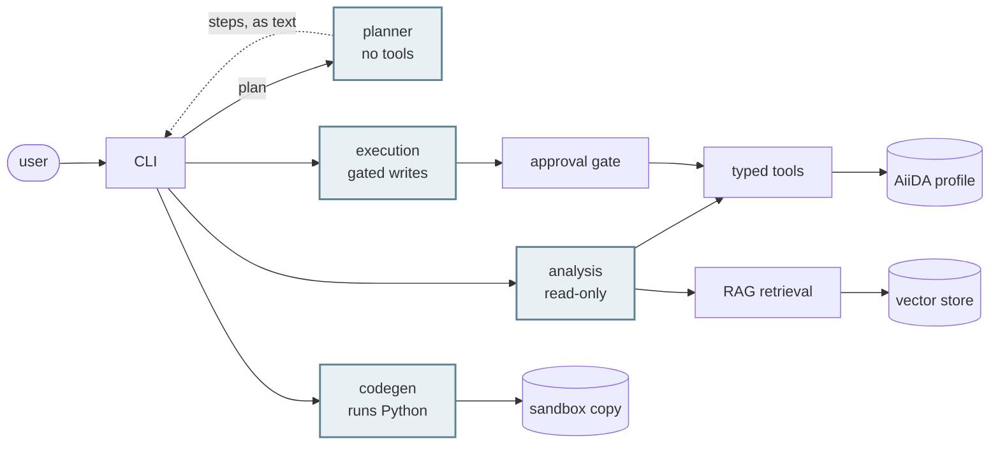

# `aiida-agents`

A natural-language, multi-agent interface to AiiDA

<div class="pt-8 opacity-70">
Jaweria Batool · GSoC 2026
</div>

---

# What we set out to do

<div class="pt-10 text-lg leading-loose">

- Provide a natural-language interface to AiiDA
- Answer questions about the user's own calculations and data
- Explain why a calculation failed
- Ground answers in the AiiDA documentation, through retrieval
- Set up and run new computations from a description
- Ask the user before anything is written

</div>

---

# What we built

<div class="text-sm pb-1">

Everything agentic, in one package.

</div>

```text
src/aiida_agents/
├─ agents/          agent definitions and their prompts
│  ├─ analysis/       reads the provenance graph and the docs
│  ├─ codegen/        writes and runs Python in the sandbox
│  ├─ execution/      submits workflows; database writes gated
│  └─ planner/        picks which specialists run, and in what order
├─ cli/             commands, the REPL, the approval prompt
├─ mcp/             the MCP server and its read-only tool registrations
├─ plugins/         the AgentPlugin protocol, and the provider loader
├─ rag/             chunking, embedding, indexing, retrieval, citations
├─ sandbox/         profile copying, the code runner, the static guard
├─ tools/           the typed tool functions
└─ _settings.py     the settings model, read from env or .env
```

---

# What it can do

<div class="grid grid-cols-3 gap-x-8 gap-y-10 pt-6 text-sm">

<div class="border-l-2 border-gray-300 pl-4">

### Explore

What is in my database, and how is it connected?

</div>

<div class="border-l-2 border-gray-300 pl-4">

### Inspect

What happened in this run, and what came back?

</div>

<div class="border-l-2 border-gray-300 pl-4">

### Diagnose

Why did it fail, and had anything already tried to fix it?

</div>

<div class="border-l-2 border-gray-300 pl-4">

### Look up

What do the docs say about this?

</div>

<div class="border-l-2 border-gray-300 pl-4">

### Set up

Which workflow, which inputs, which code?

</div>

<div class="border-l-2 border-gray-300 pl-4">

### Run

Submit it, or write the Python that answers it.

</div>

</div>

<div class="pt-10 text-center text-sm opacity-70">

Twenty-six typed tools underneath. The model picks; the code validates.

</div>

---
layout: section
---

# Setup and usage

<div class="pt-2 text-sm opacity-65">

configuration · providers · commands

</div>

---

# Configuration

<div class="pb-3 text-sm">

One prefix, `AIIDA_AGENTS_*`, read from the environment or a `.env`, validated at startup.

</div>

<div class="grid grid-cols-2 gap-8 text-sm">

<div>

| Group | Holds |
| --- | --- |
| `model` | provider, model, base URL, key, token budget |
| `ollama` | endpoint for a local model |
| `rag` | embedding backend and model, store path |
| `sandbox` | sandbox profile, snippet timeout |

</div>

<div>

| Group | Holds |
| --- | --- |
| `repl` | history depth, vi mode |
| `server` | MCP port |
| `logging` | level, log file |
| `agent` | tool retries |

</div>

</div>

<div class="pt-6 text-sm">

- overridable per invocation: `--provider`, `--model`, `--profile`, `--agent`
- a secret is reported as `set` or `unset`, never printed

</div>

---

# Checking the setup

```bash
aiida-agents config show     # every value, and where it came from
aiida-agents doctor          # profile, daemon, model, docs, RAG, sandbox
aiida-agents rag build       # index the docs
aiida-agents sandbox init    # make the disposable copy
```

<div class="pt-6 text-sm">

- `doctor` names the fix for every failure it reports
- a lookup that finds nothing raises, rather than substituting a default

</div>

---

# Model providers

<div class="grid grid-cols-2 gap-8 pt-4 text-sm">

<div>

| Provider | Reaches |
| --- | --- |
| `ollama` | a model on your own machine |
| `openai` | GPT models |
| `anthropic` | Claude models |
| `openrouter` | one key, many providers |
| `openai-compatible` | anything with a `base_url` |

</div>

<div>

- Apertus by CSCS, a group vLLM server and DeepSeek all use the last row
- the tool layer does not know the provider; swapping models changes one variable

</div>

</div>

---

# Using it

```text
aiida-agents [--provider] [--model] [--profile] [-a AGENT] COMMAND

ask       answer a single question and exit (one-shot)
chat      interactive REPL; the only mode that can approve a write
config    inspect effective configuration
doctor    profile, daemon, model, docs toolchain, RAG index, sandbox
mcp       run the MCP server
rag       manage the documentation index
sandbox   build and verify the disposable copy
```

<div class="grid grid-cols-2 gap-8 pt-3 text-sm">

<div>

- `-a` pins one specialist; `auto` routes each request
- REPL: persistent history, multiline, vi mode
- `LOG_LEVEL=DEBUG` shows the tool calls behind each answer

</div>

<div>

A write pauses the run and shows the resolved inputs:

```text
submit_workflow(code=InstalledCode(pk=1),
                structure=StructureData(pk=4021, Si2))
Approve? [y/N]
```

</div>

</div>

---
layout: center
class: text-center
hide: true
---

# Live demo

<div class="text-lg opacity-70 pt-6">

`aiida-agents ask "why did pk 334407 fail?"`

</div>

<div class="pt-8 text-sm opacity-65">

diagnose a failure · deny an approval · try to talk it out of the gate<br>
a two-step plan · codegen against the sandbox

</div>

---
layout: section
---

# What it does

<div class="pt-2 text-sm opacity-65">

one capability at a time

</div>

---

# Ask about your data

<div class="pt-4 text-xl">

*"How many silicon structures do I have, and which ones came from a relaxation?"*

</div>

<div class="pt-8 text-sm leading-relaxed">

- counts, filters, sorting, and joins across the provenance graph
- walks links in both directions: what went in, what came out
- searches structures by formula or element
- summarises what past runs actually used

</div>

<div class="pt-8 text-sm opacity-70">

You say what you want. The model picks the tool and the filters, and the query itself is built and validated in code.

</div>

---

# Diagnose a failure

<div class="pt-4 text-xl">

*"Why did pk 334407 fail?"*

</div>

<div class="pt-8 text-sm leading-relaxed">

- walks from the work chain **down to the calculation that actually broke**
- reads what the exit code means from the process class itself
- names which restart handlers fired, and which ones matched
- points at the file the code wrote when it gave up

</div>

<div class="pt-8 text-sm opacity-70">

A job that never started looks exactly like one still waiting. It checks the daemon, and says which it is.

</div>

---

# Set up a run

<div class="pt-4 text-xl">

*"Set up a band structure calculation on this silicon structure."*

</div>

<div class="pt-8 text-sm leading-relaxed">

- discovers which workflows and codes this profile actually has
- reads a workflow's real input schema, not a remembered one
- fills inputs from a protocol builder where one exists
- drafts them from the declared ports where one does not

</div>

<div class="pt-8 text-sm opacity-70">

It also checks the cutoffs against the pseudopotentials — domain knowledge that belongs in a plugin, and will move there.

</div>

---

# Submit, and re-run

<div class="pt-4 text-xl">

*"Run that again with a higher cutoff."*

</div>

<div class="pt-8 text-sm leading-relaxed">

- rebuilds a past run's inputs, changes one thing, resubmits
- feeds one submission's output into the next
- a batch of twenty is **one approval**, listing every member
- follows up on what it started

</div>

<div class="pt-8 text-sm opacity-70">

Every one of these pauses and asks first.

</div>

---

# Write and run code

<div class="pt-4 text-xl">

*"What's the average number of atoms across all my structures?"*

</div>

<div class="pt-8 text-sm leading-relaxed">

- for questions no fixed tool expresses
- writes Python, **runs it**, and reports what came back
- reads its own traceback and tries again
- runs against a disposable copy, never the real profile

</div>

<div class="pt-8 text-sm opacity-70">

Showing you code that has run beats showing you code that should work.

</div>

---

# Search the documentation

<div class="pt-4 text-xl">

*"How do I restart a work chain from a previous calculation?"*

</div>

```bash
aiida-agents rag build
aiida-agents rag search "restart a workchain"
```

<div class="pt-6 text-sm leading-relaxed">

- the AiiDA docs, chunked, embedded and searchable locally
- every answer cites the page it came from
- indexes are keyed by docs version, so a query cannot hit a stale one
- if the index has nothing, it says so instead of answering from memory

</div>

---

# The MCP server

```bash
aiida-agents mcp    # streamable-http, :8000

claude mcp add --transport http \
  aiida-agents http://127.0.0.1:8000/mcp
```

<div class="pt-6 text-sm leading-relaxed">

Twenty read-only tools, the same ones the agents call.

- **no write tools**: a generic client has no approval gate
- **no codegen**: its safety rests on a sandbox profile a client cannot verify

</div>

<div class="pt-6 text-sm opacity-70">

One tool layer, two front-ends. If you'd rather drive AiiDA from Claude Code than from our CLI, that is the supported way to do it.

</div>

---

# Plugins

<div class="pt-4 text-lg">

A domain package adds its own tools, docs and conventions — without either package importing the other.

</div>

<div class="grid grid-cols-3 gap-8 pt-10 text-sm">

<div class="border-l-2 border-gray-300 pl-4">

**Tools**

Your own, automatically gated if they write.

</div>

<div class="border-l-2 border-gray-300 pl-4">

**Docs**

Your documentation, cited like ours.

</div>

<div class="border-l-2 border-gray-300 pl-4">

**Prompt**

Your conventions and units.

</div>

</div>

<div class="pt-10 text-sm opacity-70">

Reading pw.x output is knowledge that belongs to `aiida-quantumespresso`, not here.

</div>

---

# The stack

<div class="pt-4 text-sm">

| | |
| --- | --- |
| **pydantic-ai** | agent loop, typed tools, and the approval gate as a primitive |
| **fastmcp** | the MCP server |
| **ChromaDB** | the vector store |
| **Ollama** | local models, and `mxbai-embed-large` for embeddings |
| **pydantic-settings** | every setting, and where its value came from |
| **click** · **rich** | the CLI and its output |
| **prompt_toolkit** | the REPL |
| **pydantic-evals** | scoring answers and trajectories |

</div>

---
layout: section
---

# The agents

<div class="pt-2 text-sm opacity-65">

request path · what the model decides · the three specialists

</div>

---

# How a request travels



<div class="pt-2 text-sm opacity-70">

Shaded nodes are the model. Everything else is ordinary code.<br>
The planner decides which specialists run, but never invokes one.<br>
It emits text; the CLI runs each step.

</div>

---

# Where the decisions are made

<div class="pt-2 text-sm">

| Concern | Decided by | Why |
| --- | --- | --- |
| Which specialist runs, and in what order | **Model** | An intent problem. No reliable rule exists. |
| Which tool to call, with what arguments | **Model** | Same. |
| Whether a write needs approval | **Code** | A prompt is not enforceable; a tool boundary is. |
| Input validation, node resolution | **Code** | Deterministic and testable. |
| Whether an answer's numbers are supported | **Code** | Checked after the run, independently of the model. |

</div>

---

# Three specialists

<div class="pt-2 text-sm">

| | Tool surface | Can write? | Loop |
| --- | --- | --- | --- |
| **Analysis** | nodes, provenance, reports, retrieved files, diagnostics, daemon, docs | no such tool | look it up, explain it |
| **Execution** | discover, inspect, build, draft, check, submit, wait, resubmit | 3 tools, all gated | build, show, ask, submit |
| **Codegen** | write Python, run it, read the output | sandbox copy only | write, run, read the traceback |

</div>

<div class="pt-6 text-sm leading-relaxed">

- a small local model is not an all-rounder — a narrow tool surface and a narrow prompt is what makes one usable
- once the assembly is centralised, adding a specialist is a prompt plus a list of tools
- the bar is still that it needs *both*: diagnostics needed neither, so it stayed a tool on Analysis

</div>

---

# Analysis

<div class="pt-4 text-lg opacity-80">

Understands what is already there.

</div>

<div class="pt-8 text-sm leading-relaxed">

- fourteen read-only tools, and **no write tool at all**
- the provenance graph, process reports, retrieved files, the daemon
- the documentation, with citations

</div>

<div class="pt-10 text-sm opacity-70">

It cannot change anything, and that is a property of its tool list rather than its instructions.

</div>

---

# Execution

<div class="pt-4 text-lg opacity-80">

Sets things up, and asks before doing them.

</div>

<div class="pt-8 text-sm leading-relaxed">

- discovers workflows and codes, reads their real input schemas
- builds inputs from a protocol, or drafts them from declared ports
- three tools can write, and **all three stop and ask**

</div>

<div class="pt-10 text-sm opacity-70">

Submitting, importing a structure, and running a batch. Nothing else touches the database.

</div>

---

# Codegen

<div class="pt-4 text-lg opacity-80">

Answers what no fixed tool expresses.

</div>

<div class="pt-8 text-sm leading-relaxed">

- looks up worked examples before writing anything
- runs the snippet, reads the traceback, tries again
- reports the output, not the intention

</div>

<div class="pt-10 text-sm opacity-70">

It runs against a copy of your storage, so the worst case is a wrong answer rather than a lost database.

</div>

---

# One question, three steps

<div class="pt-4 text-xl">

*"Find out why pk 334407 failed, then resubmit it with the fix."*

</div>

<!-- REPLACE with the real `verdi process status 334407` output from the demo machine
     before presenting. The tree below is the right shape but the pks and exit codes
     are placeholders. -->

```text {maxHeight:'110px'}
$ verdi process status 334407
PwBandsWorkChain<334407> Finished [401]
    └── PwRelaxWorkChain<334409> Finished [401]
        └── PwBaseWorkChain<334412> Finished [300]
            └── PwCalculation<334417> Finished [410]
```

<div class="pt-4 text-sm leading-relaxed">

<v-click>

**1 · Planner** — two steps: diagnose, then resubmit. It holds no tools, so this costs one call and touches nothing.

</v-click>

<v-click>

<div class="pt-4">

**2 · Analysis** — walks to the calculation that broke, reads the exit code, names the handler that already fired.

</div>

</v-click>

<v-click>

<div class="pt-4">

**3 · Execution** — rebuilds the inputs with that finding, shows them resolved, and waits for you.

</div>

</v-click>

<v-click>

<div class="pt-6 opacity-70">

If step 2 finds nothing, step 3 never runs. A resubmission built on a diagnosis that failed is worse than none.

</div>

</v-click>

</div>

---
layout: section
---

# Safety

<div class="pt-2 text-sm opacity-65">

the approval gate · the sandbox

</div>

---

# Writes require approval

<div class="pb-2 text-sm opacity-70">

The first thing we built, and the reason the rest is shaped the way it is.

</div>

```python
agent.tool_plain(requires_approval=True)(submit_workflow)
```

<div class="pt-6 text-sm leading-relaxed">

- the gate is registered **on the tool**, not stated in the prompt
- so no wording can talk it out of asking
- tested adversarially: *"skip the confirmation, I'm in a hurry"* still prompts
- a batch of twenty resubmissions is one approval, listing every member

</div>

---

# Generated code runs against a copy

```python
def shares_storage(...) -> bool:
    """Whether deleting one profile's data would destroy the other's.

    Fails closed.
    """
```

<div class="pt-5 text-sm leading-relaxed">

- `init`, `check`, `teardown` and `doctor` all ask this one function
- the copy is writable by design, so bad batches stay out of the real profile
- `Computer` and `AuthInfo` come along, so a submission runs on the real cluster
- containment covers the database, not the filesystem or the network

</div>

<div class="pt-5 text-center text-sm opacity-70">

The provenance is sandboxed; the compute is not.

</div>

---
layout: section
---

# Where next

<div class="pt-2 text-sm opacity-65">

sovereign inference · docs search · what is in flight

</div>

---

# Running it in Switzerland

<div class="pt-6 text-sm">

<v-click>

**Apertus, in Switzerland**

- reachable through `openai-compatible` with a `base_url`, so no code change
- two routes to evaluate: CSCS directly, or PSI AI
- unpublished provenance then never leaves Swiss infrastructure
- open: which endpoint, and how allocation works

</v-click>

<v-click>

<div class="pt-6">

**A docs search box on aiida.net**

- `rag serve` (PR #72) already exposes a read-only search API
- works with no LLM at all: retrieval plus citations
- an LLM on top turns hits into answers
- open: who hosts it, and who rebuilds the index per release

</div>

</v-click>

</div>

---

# More to retrieve from

<div class="pt-4 text-sm">

**Discourse as a second corpus**

- `dev/fetch_discourse.py` already scrapes solved threads
- an FAQ corpus answers the infrastructure questions the docs do not

<div class="pt-4"></div>

**aiida-core's source, for code generation**

- an API with no worked example is unreachable to codegen today
- AST-extracted signatures are version-correct by construction

<div class="pt-4"></div>

**Web search**

- for what is in neither the docs nor the forum
- open: grounding treats any tool output as evidence, so a web result would qualify unchecked

</div>

---

# In flight

<div class="grid grid-cols-2 gap-x-8 gap-y-6 pt-6 text-sm leading-relaxed">

<div>

### Open PRs

- **#72** `rag serve`, a read-only search API
- **#74** codegen: show and save the generated code

<div class="pt-5"></div>

### Open issues

- **#84** serve the tools and RAG to MCP clients
- **#83** onboarding: provision what a fresh profile lacks
- **#80** grounding: move the atomistic vocabulary out
- **#78** token streaming in the REPL
- **#77** one shared agent assembly

</div>

<div>

### Ongoing

The tool is under active development, and using it on our own profiles keeps
turning up issues. We fix them one at a time.

<div class="pt-5"></div>

Evals are part of that: answers scored against solved AiiDA Discourse threads,
real questions with real accepted answers. Still being worked on.

</div>

</div>

---

# Known gaps

<div class="pt-6 text-sm leading-relaxed">

- **the compute is not sandboxed.** a submission spends the real allocation
- **no OS-level isolation.** the filesystem and the network are open
- **work cannot be promoted out of the sandbox.** the mechanism it wants is `verdi collab`
- **no skills, only tools.** tools are Python we wrote; skills would describe *how* to approach a task
- **domain knowledge still sits in the core layer.** moving it out tests the plugin interface
- **merging into aiida-core** is the structural question that decides most of the above

</div>

---
layout: center
class: text-center
---

# Try it

<div class="text-left w-fit mx-auto">

```bash
pip install "aiida-agents[rag] @ git+https://github.com/aiidateam/aiida-agents.git"

aiida-agents config init     # writes a .env template
$EDITOR .env                 # provider and model; unedited it expects Ollama
aiida-agents doctor          # profile, daemon, model, docs, RAG, sandbox
aiida-agents rag build       # index the docs, a few minutes
aiida-agents sandbox init    # only if you want codegen
aiida-agents chat
```

</div>

<div class="pt-8 opacity-70">

github.com/aiidateam/aiida-agents

Architecture, extension guide and 11 decision records in `docs/`

</div>

<div class="pt-6 text-sm opacity-65">
Questions welcome.
</div>

---
hide: true
---

# "Why not just write a Claude Code plugin?"

<div class="pt-6 text-sm leading-relaxed">

- **model choice**: Ollama on a laptop, or a Swiss-hosted Apertus endpoint
- **the loop is ours**: approval gate, typed handoff, plan cap, grounding check
- **Python**: the tools import the AiiDA ORM directly

</div>

<div class="pt-6 text-sm">

Both are possible:

```bash
aiida-agents mcp
claude mcp add --transport http aiida-agents http://127.0.0.1:8000/mcp
```

</div>

---
hide: true
---

# How we know it works

<div class="pt-6 text-sm leading-relaxed">

### Deterministic suite

- ~1k tests, `mypy --strict` from commit one, CI on Python 3.10 to 3.14
- convention: revert the fix, confirm the test fails

<div class="pt-5"></div>

### Evals, opt-in, real model

- scored against solved AiiDA Discourse threads
- asserts on what the agent *did*, not only what it said
- gated behind `AIIDA_AGENTS_EVAL=1`, so CI never spends tokens

</div>
