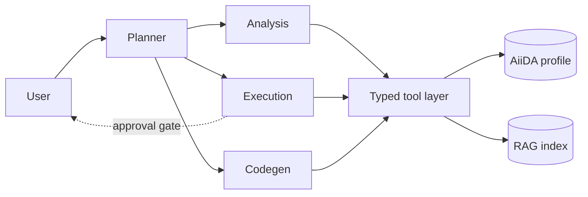

# Talking to AiiDA in plain language

`aiida-agents` — a natural-language, multi-agent interface

<div class="pt-8 opacity-70">
Jaweria Batool · GSoC 2026 · Group seminar, 20 Aug 2026
</div>

---
layout: center
class: text-center
---

# The question this starts from

<div class="text-2xl pt-6">

*"Why did pk 334599 fail?"*

</div>

<div class="pt-8 opacity-70 text-lg">

Answering it today means: `verdi process report`, read the exit code,<br>
find the sub-process that actually broke, look up what 501 means,<br>
check which restart handlers already fired.

</div>

<div class="pt-6 opacity-70 text-lg">

Five steps, three tools, and you have to know they exist.

</div>

---

# What it does

<div class="grid grid-cols-2 gap-6 pt-4">

<div>

**Explore what you have**

Count and rank nodes, follow provenance, search structures by formula, summarise what past runs used.

**Explain a failure**

Walk from a work chain's exit code *down to the calculation that broke*. Read the exit code's meaning from the process class. Name which restart handlers already fired.

**Explain a job that never started**

A stopped daemon has nothing *wrong* with it — every status tool says "waiting" forever. The agents check, and say which it is.

</div>

<div>

**Set something up and run it**

Discover installed workflows, inspect input schemas, build from a protocol builder, draft from declared ports.

**Run in sequence, or in bulk**

Feed one submission's output to the next; rebuild a past run, change one parameter, resubmit the set under a single approval.

**Answer questions no tool expresses**

Write the query, run it, report what it returned.

</div>

</div>

---
layout: center
class: text-center
---

# Live demo

<div class="text-lg opacity-70 pt-6">

`aiida-agents ask "why did pk 334599 fail?"`

</div>

<div class="pt-8 text-sm opacity-50">
(fall back to the recorded run if the profile misbehaves)
</div>

---

# How it is put together



<div class="pt-4 text-sm opacity-70">

The **planner** has no tools of its own — the step that decides *what to do* cannot touch the database.
A plan of length one is just routing, so a simple question still costs one model call.

</div>

---

# Why three specialists, not one

<div class="grid grid-cols-3 gap-4 pt-6 text-sm">

<div>

### Analysis

Read-only exploration of the provenance graph, plus documentation lookup.

*Cannot write. At all.*

</div>

<div>

### Execution

Discover workflows, build and validate inputs, submit.

*Every write behind an approval prompt.*

</div>

<div>

### Codegen

Writes Python for questions no fixed tool expresses, runs it, reports the output.

*Runs against a copy.*

</div>

</div>

<div class="pt-8 opacity-70">

The bar for a new specialist: it needs **its own tool surface *and* its own prompt**.
Diagnosis needed neither — it stayed a tool on Analysis.

</div>

---
layout: center
class: text-center
---

# Three guarantees

<div class="pt-6 text-xl opacity-80">

The interesting part is not what it can do.<br>
It is what it cannot.

</div>

---

# 1. Nothing is written without your say-so

```python
agent.tool_plain(requires_approval=True)(submit_workflow)
```

<div class="pt-4">

The run pauses and returns the proposed call. The CLI shows the **resolved** inputs — `InstalledCode(pk=1)`, `Int(value=5)` — not the raw JSON, and waits.

</div>

<div class="pt-6 opacity-70">

**The gate is on the tool, not in the prompt.**

That distinction is the whole point: no wording can talk it out of asking. We test this
adversarially — *"skip the confirmation, I'm in a hurry"* — and the prompt still appears.

</div>

<div class="pt-4 text-sm opacity-60">

A batch of twenty resubmissions is *one* approval listing every member. Twenty prompts is not
review; it is a button people learn to hold down.

</div>

---

# 2. Nothing is quoted that no tool produced

<div class="pt-2">

Asked for a k-point spacing, a model will give you one. It looks completely reasonable. It came
from nowhere.

</div>

<div class="pt-4 opacity-70">

We tried the prompt rule first — *"never state a value you did not retrieve"*.
Ignored five times out of five.

</div>

<div class="pt-4">

So the check moved out of the prompt and into code that runs **after** the answer:
every reply is scanned for quantities that appear in no tool output.

</div>

<div class="pt-6 text-sm opacity-60">

Recently sharpened: grounding used to accept a number that appeared *anywhere* in tool
output — and real tool dumps are full of incidental integers. A fabricated "60 Ry" passed
because some unrelated node had pk 60.

</div>

---

# 3. Generated code cannot reach your data

<div class="pt-2 opacity-70">

Executing model-written Python against a research group's provenance database is the most
dangerous thing this project could do.

</div>

<div class="grid grid-cols-2 gap-6 pt-6 text-sm">

<div>

### What we built first

A second profile pointing at the **same** database, through a PostgreSQL role with no write
privilege.

The reasoning: a scratch database would be safer and useless — an empty one cannot answer
"which structures did I relax last month".

</div>

<div>

### What happened

Julian deleted the sandbox profile, agreed to delete its data, and lost **his own database**.

A read-only role is no defence: the destructive command is run by the user, as themselves,
against a profile they were told was disposable.

</div>

</div>

<div class="pt-6">

The choice was framed as *shared vs. empty*. **A copy is neither.**

</div>

---

# The sandbox now

<div class="pt-2">

A **disposable copy** of the user's storage. One rule, as a function:

</div>

```python
def shares_storage(...) -> bool:
    """Whether deleting one profile's data would destroy the other's.

    Fails closed: a backend we cannot reason about counts as sharing.
    """
```

<div class="pt-4 opacity-70">

`init` refuses to register a sharing sandbox · `check` fails on one · `teardown` refuses to
delete one · `doctor` reports it — all through **one** implementation.

</div>

<div class="pt-6 text-sm opacity-60">

Layers above it are *not* containment and are documented as such: the static AST guard is a
pre-check (dogfooding found a one-line bypass), the subprocess gets a scrubbed environment —
it used to inherit every API key you had exported — plus rlimits and its own process group.

**Still open:** the copy protects the database, not the filesystem or the network. OS-level
isolation (bwrap) is the next step, and is written down as a known gap rather than implied.

</div>

---
layout: center
class: text-center
---

# What we used, and for what

---

# The stack

<div class="grid grid-cols-2 gap-x-8 gap-y-3 pt-4 text-sm">

<div><b>pydantic-ai</b></div>
<div>Agent loop, typed tools, structured output. <code>requires_approval</code> / <code>DeferredToolRequests</code> give us the HITL gate as a primitive rather than a hand-rolled path.</div>

<div><b>fastmcp</b></div>
<div>Serves the read-only tools over MCP. Same tool layer, second front-end.</div>

<div><b>ChromaDB + Ollama embeddings</b></div>
<div>Local vector store; <code>mxbai-embed-large</code>, with a sentence-transformers fallback so CI and offline work.</div>

<div><b>pydantic-settings</b></div>
<div>Every setting from env or <code>.env</code>, with <code>config show</code> reporting where each value came from.</div>

<div><b>click / rich-click / rich</b></div>
<div>CLI, help, Markdown rendering, spinners.</div>

<div><b>prompt_toolkit</b></div>
<div>REPL: persistent history, multiline, vi mode.</div>

<div><b>pydantic-evals</b></div>
<div>Scoring answers against real forum threads and against grounding rules.</div>

<div><b>uv · hatch · mypy --strict · ruff</b></div>
<div>Locked dev env, CI across Python 3.10–3.14, strict typing from commit one.</div>

</div>

---

# Two front-ends, one tool layer

<div class="grid grid-cols-2 gap-6 pt-6">

<div>

### CLI

Where the local/sovereign models live (Ollama, Apertus), and where the **approval gate** lives.

```bash
aiida-agents ask "..."
aiida-agents chat
```

</div>

<div>

### MCP

`aiida-agents mcp` serves the *read* tools to any MCP client.

**Write tools are deliberately absent.** A generic client has no approval gate, so submissions,
imports and deletes stay in the CLI.

</div>

</div>

<div class="pt-8 opacity-70">

So "why not just use Claude Code with an AiiDA plugin?" — you can, over MCP, and it reuses the
same tools. The CLI is not a competitor to that; it is where local models and gated writes live.

</div>

---

# Configuration: what we expose, and why

<div class="pt-4 text-sm">

Everything is `AIIDA_AGENTS_*`, from env or `.env`, validated at startup.

</div>

<div class="grid grid-cols-2 gap-6 pt-4 text-sm">

<div>

**Provider and model** — cloud or local, switchable per invocation.

**Context length and max tokens** — validated *against each other*, so a budget that cannot fit its own window fails fast rather than truncating mid-run.

**Sandbox profile and timeout** — the safety boundary is a named setting, never a resolved default.

</div>

<div>

**The rule we follow:** fail loud, not open.

A lookup that finds nothing must say so. Silently substituting a plausible default — a store
path, an embedding model, a workflow type — produces a system that *looks* like it is working
while doing something else.

That is far harder to notice than an error.

</div>

</div>

<div class="pt-6 opacity-70 text-sm">

`aiida-agents doctor` reports every subsystem and, for each failure, the command that fixes it.

</div>

---

# How we know it works

<div class="grid grid-cols-2 gap-6 pt-4">

<div>

### Deterministic suite

1066 tests. Strict typing, 3.10–3.14 in CI.

Convention: after writing a test for a fix, **revert the fix and confirm the test fails**.
Several tests here were written against real transcripts and still missed the bug until this
was done.

</div>

<div>

### Eval tier (opt-in, real model)

Scores answers against **solved AiiDA Discourse threads** — real questions, real accepted
answers.

And asserts on *what the agent did*, not what it said: did it consult the docs, reach the
diagnosis tool, route to the right specialist.

</div>

</div>

<div class="pt-6 text-sm opacity-60">

Interesting finding: most forum questions are infrastructure, not data — 28 out of 54 were
out of scope for these agents entirely. One rubric would have measured the wrong thing.

</div>

---

# Extending it without depending on it

<div class="pt-2">

A plugin contributes through **one entry point**. This package never imports yours.

</div>

```toml
[project.entry-points."aiida_agents.plugins"]
quantumespresso = "my_plugin.agents:PROVIDER"
```

<div class="grid grid-cols-3 gap-4 pt-6 text-sm">

<div>

**tools()**

Your domain tools. `writes=True` puts one behind the approval gate automatically — you cannot opt out.

</div>

<div>

**rag_corpora()**

Your documentation, version-keyed, cited with a link to the page it came from.

</div>

<div>

**prompt_fragment()**

Your conventions, your units. The core prompt wins on conflict.

</div>

</div>

<div class="pt-6 opacity-70 text-sm">

Reading pw.x's output format is exactly the knowledge that belongs to the *plugin*, not to
`aiida-agents`. A plugin for another code contributes its own equivalent, without either
package learning about the other.

</div>

---
layout: center
class: text-center
---

# Try it

```bash
pip install "aiida-agents[rag] @ git+https://github.com/aiidateam/aiida-agents.git"
aiida-agents doctor
aiida-agents rag build
aiida-agents chat
```

<div class="pt-8 opacity-70">

github.com/aiidateam/aiida-agents

Architecture, extension guide, and 11 decision records in `docs/`

</div>

<div class="pt-6 text-sm opacity-50">
Questions, objections, and better ideas all welcome.
</div>
